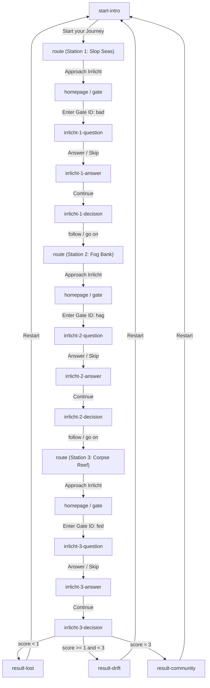

# swamp.lost — Technical Design Document

> Based on [0626_swamp.lost_Seitenarchitektur.md](file:///Users/malcolm/Documents/swamp.lost/0626_swamp.lost_Seitenarchitektur.md)

---

## 1. Overview

**swamp.lost** is an interactive, browser-based narrative game exploring themes of trust, verification, and digital identity. Players navigate a metaphorical swamp of AI-generated content, encountering three *Irrlichter* (will-o'-the-wisps) who pose philosophical questions. Players must decide which Irrlichter to follow and which to leave behind. Their choices determine one of three endings.

The game is designed as a **single-page application (SPA)** using **vanilla HTML, CSS, and JavaScript** — no frameworks, no build tools, no dependencies. This maximizes long-term maintainability and eliminates version rot.

---

## 2. Open Questions

### 2.1 Scoring Threshold Clarification

The spec defines result thresholds as:

- `Score < 1` → Lost
- `Score > 1` → Drift
- `Score = 3` → Community

Given the possible final scores are **-3, -1, +1, +3**, score `+1` technically falls *between* the `< 1` and `> 1` thresholds (it is neither `< 1` nor `> 1`). The proposed implementation interprets this as:

| Condition | Scores Covered | Result |
|---|---|---|
| `score < 1` | -3, -1 | **Lost** |
| `score >= 1 AND score < 3` | +1 | **Drift** |
| `score === 3` | +3 | **Community** |

**→ Please confirm this is the intended logic.**

### 2.2 Possible Copy-Paste Error in Spec

The **route-corpse-reefs** section (spec lines 166–167) uses the title *"Fog Bank"* and main text *"You arrive at the Fog Banks."* — identical to the previous station. The body content, however, says *"Corpse Reef."*

The game texts file corrects this to:

- Title: `"Corpse Reef"`
- Main text: `"You arrive at the Corpse Reefs."`

**→ Please confirm this correction is intended.**

---

## 3. Architecture

### 3.1 Design Principles

| Principle | Implementation |
|---|---|
| **Content / Code separation** | All player-visible text lives in a dedicated `gameTexts.js` module. Zero hardcoded strings in HTML or logic. |
| **Single source of truth** | Game state is centralized in one `state.js` module. All components read from and write to this single store. |
| **No build step** | Vanilla ES modules loaded natively by the browser. No bundler, no transpiler, no `npm install`. |
| **Stateless rendering** | Each page render is a pure function of current state. Navigating to a page always produces the same DOM for the same state. |
| **Mobile-first responsive** | CSS breakpoint at `700px` as specified. One layout system, one codebase. |

### 3.2 Game Flow



### 3.3 Decision Tree

| Station | Gate ID | `follow` | `go on` | Next Gate |
|---------|---------|----------|---------|-----------|
| Irrlicht 1 | `bad` | −1 | +1 | `hag` |
| Irrlicht 2 | `hag` | +1 | −1 | `fed` |
| Irrlicht 3 | `fed` | −1 | +1 | *(none — go to result)* |

**All 8 possible paths:**

| Choice 1 | Choice 2 | Choice 3 | Final Score | Result |
|----------|----------|----------|-------------|--------|
| go on (+1) | follow (+1) | go on (+1) | **+3** | Community |
| go on (+1) | follow (+1) | follow (−1) | **+1** | Drift |
| go on (+1) | go on (−1) | go on (+1) | **+1** | Drift |
| follow (−1) | follow (+1) | go on (+1) | **+1** | Drift |
| follow (−1) | follow (+1) | follow (−1) | **−1** | Lost |
| follow (−1) | go on (−1) | go on (+1) | **−1** | Lost |
| go on (+1) | go on (−1) | follow (−1) | **−1** | Lost |
| follow (−1) | go on (−1) | follow (−1) | **−3** | Lost |

---

## 4. File Structure

```
swamp.lost/
├── index.html                  # Single entry point (SPA shell)
│
├── css/
│   ├── tokens.css              # Design tokens (CSS custom properties)
│   ├── base.css                # Reset, typography, global styles
│   ├── components.css          # Buttons, inputs, text boxes, cards
│   ├── pages.css               # Page-specific layouts
│   └── responsive.css          # Media queries (< 700px)
│
├── js/
│   ├── app.js                  # Application bootstrap & initialization
│   ├── router.js               # Client-side page routing & transitions
│   ├── state.js                # Centralized game state management
│   ├── gameLogic.js            # Scoring, gate validation, question selection
│   ├── renderer.js             # DOM rendering (page builders)
│   └── pages/                  # Page-specific render functions
│       ├── introPage.js
│       ├── gatePage.js
│       ├── routePage.js
│       ├── questionPage.js
│       ├── answerPage.js
│       ├── decisionPage.js
│       └── resultPage.js
│
├── content/
│   └── gameTexts.js            # ALL in-game text (dedicated text module)
│
├── assets/
│   └── images/                 # Irrlicht portraits & background assets
│       ├── irrlicht-1.png
│       ├── irrlicht-2.png
│       └── irrlicht-3.png
│
└── docs/
    └── 0626_swamp.lost_Seitenarchitektur.md
```

---

## 5. Module Design

### 5.1 `content/gameTexts.js` — Game Text Module

**Purpose:** Single source of truth for every player-visible string. Editing game content never requires touching HTML, CSS, or logic files.

**Dedicated file:** See [gameTexts.js](file:///Users/malcolm/Documents/swamp.lost/content/gameTexts.js)

**Key design decisions:**

- Exported as a frozen ES module constant (`Object.freeze`) to prevent accidental mutation
- Flat, predictable key paths: `GAME_TEXTS.routes[1].title`
- Irrlicht questions stored as arrays of `{ question, answer }` objects — the random selection happens in `gameLogic.js`, not in the text file
- UI labels (button text, error messages, input placeholders) are also externalized here

### 5.2 `js/state.js` — State Management

**Purpose:** Single, centralized game state object. All mutations go through exported setter functions that validate transitions.

```js
// state.js — API surface
export function getState()           // → frozen snapshot of current state
export function resetState()         // → reset to initial state
export function setCurrentStation(n) // → 1, 2, or 3
export function setSelectedQuestion(stationIndex, questionIndex)
export function setPlayerAnswer(stationIndex, answerText)
export function applyDecision(stationIndex, choice) // 'follow' | 'goOn'
export function getExpectedGateId()  // → current expected gate ID string
export function getFinalResult()     // → 'lost' | 'drift' | 'community'
```

**State shape:**

```js
{
  currentStation: 1,          // 1–3
  phase: 'intro',             // 'intro'|'route'|'gate'|'question'|'answer'|'decision'|'result'
  score: 0,                   // cumulative score
  expectedGateId: 'bad',      // current expected gate ID
  stations: {
    1: { selectedQuestion: null, playerAnswer: null, decision: null },
    2: { selectedQuestion: null, playerAnswer: null, decision: null },
    3: { selectedQuestion: null, playerAnswer: null, decision: null }
  }
}
```

**Persistence:** State is serialized to `sessionStorage` on every mutation. If the player refreshes, the game resumes from the current phase. A full restart clears the session.

### 5.3 `js/router.js` — Page Router

**Purpose:** Hash-based client-side routing. No server required. Works from `file://` protocol.

**Routes:**

| Hash | Page | Module |
|------|------|--------|
| `#/intro` | Start Intro | `introPage.js` |
| `#/route` | Route Page (uses `state.currentStation`) | `routePage.js` |
| `#/gate` | Gate Input / Homepage | `gatePage.js` |
| `#/question` | Irrlicht Question | `questionPage.js` |
| `#/answer` | Irrlicht Answer | `answerPage.js` |
| `#/decision` | Follow / Go On | `decisionPage.js` |
| `#/result` | Final Result | `resultPage.js` |

**Transition system:** Route changes trigger a CSS-animated fade-out / fade-in on the `#app` container. This creates atmospheric page transitions consistent with the dark, moody aesthetic.

### 5.4 `js/gameLogic.js` — Game Logic

**Purpose:** Pure functions for all game mechanics. No DOM access, no side effects.

```js
export function validateGateId(input, expected)    // → boolean
export function selectRandomQuestion(stationIndex) // → 0, 1, or 2
export function calculateScoreChange(stationIndex, choice) // → +1 or -1
export function determineResult(totalScore)        // → 'lost' | 'drift' | 'community'
export function getNextGateId(stationIndex)        // → string | null
export function getStationConfig(stationIndex)     // → { gateId, scoring, nextGateId }
```

**Station configuration (centralized, not scattered):**

```js
const STATION_CONFIG = [
  { gateId: 'bad', scoring: { follow: -1, goOn: +1 }, nextGateId: 'hag' },
  { gateId: 'hag', scoring: { follow: +1, goOn: -1 }, nextGateId: 'fed' },
  { gateId: 'fed', scoring: { follow: -1, goOn: +1 }, nextGateId: null  }
];
```

**Result determination:**

```js
export function determineResult(score) {
  if (score >= 3) return 'community';
  if (score >= 1) return 'drift';
  return 'lost';
}
```

### 5.5 `js/renderer.js` — DOM Renderer

**Purpose:** Shared DOM utilities used by all page modules.

```js
export function clearApp()                          // → empty #app container
export function createElement(tag, attrs, children) // → DOM element factory
export function renderPage(buildFn)                 // → fade-out, clear, build, fade-in
export function createButton(text, onClick)         // → styled button element
export function createTextBox(text, type)           // → question/answer box with left border
```

### 5.6 `js/pages/*.js` — Page Modules

Each page module exports a single `render()` function that:

1. Reads current state from `state.js`
2. Reads display text from `gameTexts.js`
3. Builds DOM elements via `renderer.js`
4. Attaches event handlers that call `state.js` setters and `router.js` navigation

**Example — `questionPage.js`:**

```js
import { getState, setPlayerAnswer } from '../state.js';
import { GAME_TEXTS } from '../../content/gameTexts.js';
import { renderPage, createButton, createTextBox } from '../renderer.js';
import { navigateTo } from '../router.js';

export function render() {
  const state = getState();
  const station = state.currentStation;
  const qIndex = state.stations[station].selectedQuestion;
  const irrlicht = GAME_TEXTS.irrlichter[station];
  const qa = irrlicht.questions[qIndex];

  renderPage((container) => {
    container.append(
      createTextBox(qa.question, 'question'),
      createAnswerInput(),
      createButton(GAME_TEXTS.ui.submitAnswer, () => submitAnswer(station)),
      createButton(GAME_TEXTS.ui.skip, () => skipAnswer(station))
    );
  });
}
```

---

## 6. CSS Design System

### 6.1 Design Tokens (`css/tokens.css`)

All visual constants defined as CSS custom properties on `:root`:

```css
:root {
  /* ── Colors ── */
  --color-bg:             #0a0a0a;
  --color-bg-deep:        #050505;
  --color-surface:        #111411;
  --color-text:           #c8c8c0;
  --color-text-muted:     #7a7a72;
  --color-accent:         #00e5cc;         /* Cyan glow */
  --color-accent-dim:     #00e5cc40;       /* Cyan at 25% opacity */
  --color-green-dark:     #0a2a1a;
  --color-green-glow:     #1aff8c20;       /* Dark green radial glow */
  --color-border:         #2a2a2a;
  --color-error:          #ff4444;

  /* ── Typography ── */
  --font-serif:           'Playfair Display', 'Georgia', serif;
  --font-mono:            'JetBrains Mono', 'Fira Code', 'Courier New', monospace;
  --font-size-title:      clamp(2rem, 5vw, 3.5rem);
  --font-size-subtitle:   clamp(1.1rem, 2.5vw, 1.5rem);
  --font-size-body:       clamp(1rem, 2vw, 1.2rem);
  --font-size-question:   clamp(1.3rem, 3vw, 2rem);
  --font-size-button:     0.85rem;
  --font-size-input:      1rem;

  /* ── Spacing ── */
  --space-xs:             0.5rem;
  --space-sm:             1rem;
  --space-md:             2rem;
  --space-lg:             4rem;
  --space-xl:             6rem;

  /* ── Layout ── */
  --content-max-width:    720px;
  --content-padding:      var(--space-md);

  /* ── Effects ── */
  --glow-radius:          600px;
  --transition-page:      0.6s ease-in-out;
  --transition-hover:     0.3s ease;
  --grain-opacity:        0.04;
  --vignette-spread:      40%;
}
```

### 6.2 Visual Components

| Component | Spec | CSS Class |
|-----------|------|-----------|
| **Question box** | Large serif text, left cyan border, `--color-text` | `.text-box--question` |
| **Answer box** | Large serif text, left border, `--color-text-muted` | `.text-box--answer` |
| **Button** | Monospace, uppercase, thin border, hover glow | `.btn` |
| **Gate input** | Monospace, dark bg, cyan focus glow | `.gate-input` |
| **Page container** | Centered, max-width, vignette + grain overlay | `.page` |

### 6.3 Background Effects

Achieved with CSS pseudo-elements on `body` — no images or JS required:

- **Radial glow:** `radial-gradient` from `--color-green-glow` centered on viewport
- **Vignette:** `radial-gradient` from transparent center to `--color-bg-deep` edges
- **Noise/Grain:** CSS `filter: url(#noise)` with an inline SVG turbulence filter, at `--grain-opacity`

### 6.4 Page Transitions

```css
.page {
  opacity: 1;
  transition: opacity var(--transition-page);
}
.page--exiting {
  opacity: 0;
}
.page--entering {
  opacity: 0;
  animation: fadeIn var(--transition-page) forwards;
}
@keyframes fadeIn {
  to { opacity: 1; }
}
```

---

## 7. Maintainability Matrix

| "I need to…" | What to edit | Files touched |
|---|---|---|
| Change any game text | `content/gameTexts.js` | 1 |
| Add a 4th Irrlicht | `gameTexts.js` + `gameLogic.js` + `state.js` | 3 |
| Change colors or typography | `css/tokens.css` | 1 |
| Change the scoring formula | `gameLogic.js` → `determineResult()` | 1 |
| Add a new page type | New file in `js/pages/` + register in `router.js` | 2 |
| Translate the game | Swap `content/gameTexts.js` for localized version | 1 |
| Deploy offline / from USB | Nothing — hash routing + ES modules work on `file://` | 0 |

---

## 8. Verification Plan

### Functional Testing

- Walk through all **8 possible game paths** (see §3.3) and confirm correct result page
- Verify gate ID validation rejects incorrect inputs and accepts correct ones (case-sensitive)
- Confirm random question selection works (play same station multiple times, see all 3 questions)
- Test page refresh mid-game — state should persist via `sessionStorage`
- Test restart — state should fully clear

### Visual / Responsive Testing

- Test on mobile viewport (< 700px) — layout adapts per spec
- Verify background effects: radial glow, vignette, noise/grain render correctly
- Confirm button hover-glow animations
- Verify question/answer boxes have correct left-border styling

### Compatibility

- Chrome, Firefox, Safari (ES modules support required)
- Works from `file://` protocol (no server needed)

### Content Integrity

- Verify all text on screen matches `gameTexts.js` content exactly
- Confirm **zero** hardcoded strings in HTML or JS page modules
